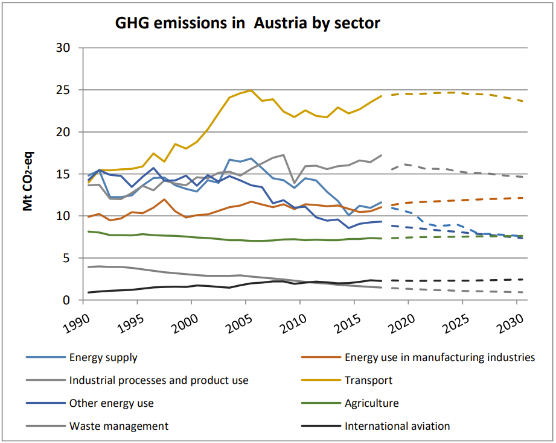
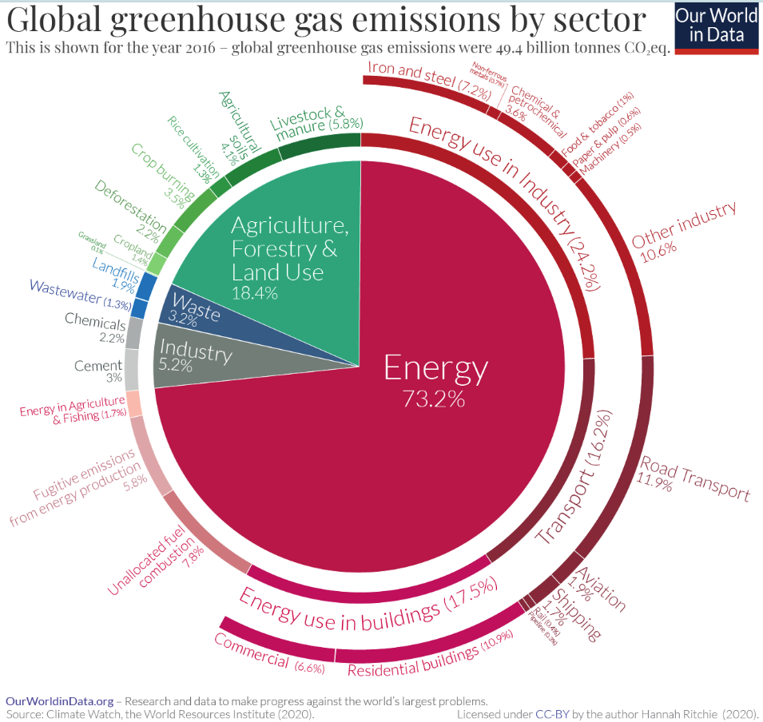
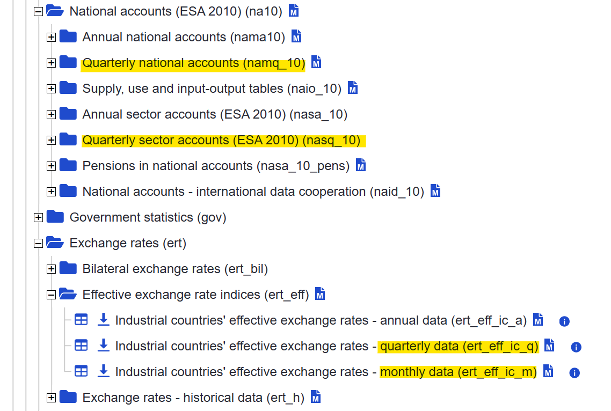
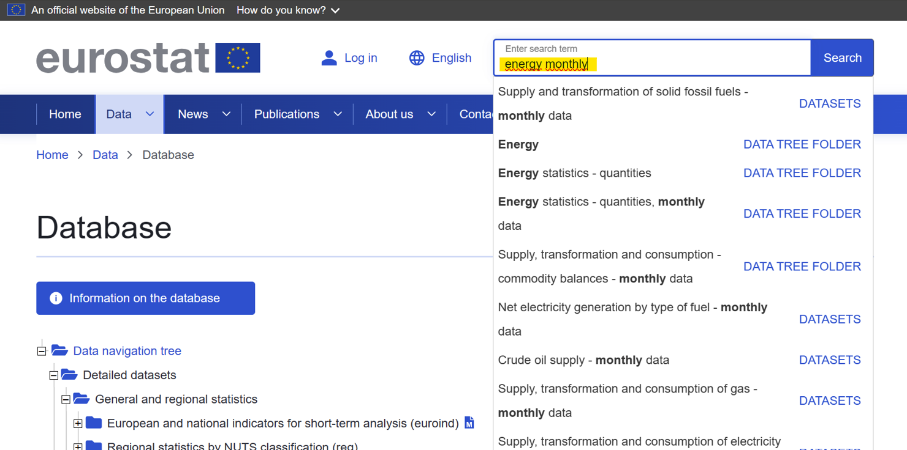

```{r, include = FALSE}
knitr::opts_chunk$set(
collapse = TRUE,
comment = "#>",
fig.width = 7,
fig.height = 6,
out.width = "100%",
dpi = 300
)
```

This is a vignette to describe the process to create and run a model using the aggregate model package works a new variable to the Dictionary of the package. First this vignette will touch on what to think of or keep in mind when selecting variables and conceptually setting up a model. Then the set-up and running of the model will be elaborated on step by step.

# General first steps

## Choosing variables

Selecting fitting variables for the kind of output to be obtained is crucial for success. Before looking into the available data at hand (from [eurostat](https://ec.europa.eu/eurostat/data/database) or [edgar](https://edgar.jrc.ec.europa.eu/emissions_data_and_maps)) it makes sense to first theoretically conceptualize which type of variables, indicators, or sectors are relevant to the desired predictive outcome. For example, aiming to create a small model to predict CO2 emissions in Austria, it makes sense to beforehand look at government statistics and other (academic) sources of research and information to identify sectors that have the largest impact on Austrian emissions. For example, drawing on [data from the European Climate Pact on emissions in Austria by sector](https://climate.ec.europa.eu/system/files/2019-10/at_factsheet_en.pdf), it would make sense to include variables on the transport industry, waste management, energy supply and use, and agriculture in the model:

{width="100%"}

Sometimes, data from data compilers like ["Our World in data"](https://ourworldindata.org/) can also help in the initial phase of conceptualising a model to get an overview of overall data trends and influencing factors. The graphic below, for example, identifies sectors most crucial for emission reduction on a global level:

{width="100%"}

Given this graphic, it would make sense to factor in energy usage from different sectors into the model. However, since the aggregate model currently runs on quarterly and monthly data available from eurostat and edgar, there is a certain limitation to the amount of variables of use to the model. Sometimes variables identified relevant in the conceptual stage cannot be used for the model. For example, "Energy supply and use by NACE Rev. 2 activity" from eurostat would make a good variable to use in a small model predicting emissions for Austria based on the emissions of different sectors. But this variable, which would let us account for energy use based on sector, is only available on an annual basis and therefore not useful to our model.

Hence, when selecting variables, attention should be paid to the time frequency data is collected at to only choose variables available with monthly or quarterly data accounts. Unfortunately, it is not possible to filter on eurostat for variables based on time frequency. However, usually, if not indicated otherwise, data is collected on an annual basis. As the images below show, when data is collected on monthly or quarterly basis, this is indicated in the name of the category the variables are stored in or the variable name itself:

{width="100%"}

Another option to find monthly, or quarterly data would be to search by keywords using, for example, "energy" and "monthly", in the search bar on eurostat to find variables with monthly data on energy. However, the eurostat search function will only find variables, if any exist, with the exact keywords in the name that were used in the search:

{width="100%"}

## Preperations in R before creating the model

Before starting to actually create and run the model, make sure to install and load all relevant packages, as well as the latest version of the aggregate model.

```{r, message=FALSE}
library(aggregate.model)
library(dplyr)
library(eurostat)
library(ggplot2)
library(tidyverse)
library(kableExtra)
library(ggtext)
library(here)
library(modelsummary)
```

# Detailed model set up and running - example of a small environmental model

## Setting up the dictionary

After the conceptual work and selection of variables to be used in the model, a dictionary must be created for all variables that are not yet contained in the original dictionary that comes with the aggregate model package. Make sure to double check whether variables selected for the model to be created might not already exist in the initial dictionary.

Detailed instructions on how to add variables to the existing dictionary can be found in the [vignette "Adding a new variable to the Dictionary"](https://moritzschwarz.org/aggregate.model/articles/new_variable_to_dict.html).

The example below shows the setting up of the directory for a small rudimentary model on emissions in Austria.

```{r}
dict %>%
  #This is an example of a variable added from Edgar:
  bind_rows(tibble(
    model_varname = "N2O_soils", #choose a name for the variable that is unique 
    full_name = "Direct N2O Emissions from managed soils", #Enter the full name/describe the variable
    database  = "edgar", #specify the data source
    dataset_id = "https://jeodpp.jrc.ec.europa.eu/ftp/jrc-opendata/EDGAR/datasets/v80_FT2022_GHG/EDGAR_N2O_m_1970_2022b.zip", #include the link to the data set
    freq = "m", #indicate the time frequency (can be m for monthly or q for quarterly)
    ipcc_sector = "3.C.4", #for Edgar variables, specify the ipcc_sector information (to be found in the excel data file the variable is contained in)
    geo = "AT" )) %>% #set the geographical region for the model, add a pipe operator to add multiple variables to the dictionary at once
  #This is an example of a variable added from Eurostat:
  bind_rows(tibble(
    model_varname = "Price_agrpro",
    full_name = "Price indices of agricultural products, output",
    database  = "eurostat", #define database as eurostat
    variable_code = "140000", #add the variable code (this specifies which details the variable should represent)
    dataset_id = "apri_pi20_outq", #add the dataset ID
    var_col = "product", #add the column name the variable code specification was chosen from 
    freq = "q",
    geo = "AT",
    unit = "I20", #if given, define the unit
    s_adj = "NSA", #chose between seasonally adjusted or unadjusted data (if given)
    nace_r2 = "B-D")) %>% #define the nace_r2 sector specification, if applicable
  bind_rows(tibble(
    model_varname = "Price_animpro",
    full_name = "Price indices of agricultural products - Agricultural goods output",
    database  = "eurostat",
    variable_code = "140000",
    dataset_id = "apri_pi15_outq",
    var_col = "product",
    freq = "q",
    geo = "AT",
    unit = "I15",
    p_adj = "NI")) %>%
  bind_rows(tibble(
    model_varname = "ind_N2O_mm",
    full_name = "Indirect N2O Emissions from manure management",
    database  = "edgar",
    ipcc_sector = "3.C.6",
    dataset_id = "https://jeodpp.jrc.ec.europa.eu/ftp/jrc-opendata/EDGAR/datasets/v80_FT2022_GHG/EDGAR_N2O_m_1970_2022b.zip",
    freq = "m",
    geo = "AT")) %>%
  bind_rows(tibble(
    model_varname = "Flights",
    full_name = "National air passenger transport by reporting country",
    database  = "eurostat",
    variable_code = "CAF_PAS",
    dataset_id = "avia_panc",
    var_col = "tra_meas",
    freq = "m",
    geo = "AT",
    unit = "FLIGHT")) %>%
  bind_rows(tibble(
    model_varname = "Prod_Constr_Manu",
    full_name = "Production in Construction",
    database  = "eurostat",
    variable_code = "PROD",
    dataset_id = "sts_copr_m",
    var_col = "indic_bt",
    freq = "m",
    geo = "AT",
    unit = "I21",
    s_adj = "NSA",
    nace_r2 = "B-D_F")) %>%
  bind_rows(tibble(
    model_varname = "CO2_aviation",
    full_name = "CO2 (fossil) emissions from Civil Aviation",
    database  = "edgar",
    ipcc_sector = "1.A.3.a",
    dataset_id = "https://jeodpp.jrc.ec.europa.eu/ftp/jrc-opendata/EDGAR/datasets/v80_FT2022_GHG/IEA_EDGAR_CO2_m_1970_2022b.zip",
    freq = "m",
    geo = "AT")) %>%
  bind_rows(tibble(
    model_varname = "CO2_roads",
    full_name = "CO2 (bio) emissions from Road",
    database  = "edgar",
    ipcc_sector = "1.A.3.b_noRES",
    dataset_id = "https://jeodpp.jrc.ec.europa.eu/ftp/jrc-opendata/EDGAR/datasets/v80_FT2022_GHG/IEA_EDGAR_CO2_m_1970_2022b.zip",
    freq = "m",
    geo = "AT")) %>%
  bind_rows(tibble(
    model_varname = "CO2_Manufactoring",
    full_name = "CO2 (fossil) emissions from Manufacturing Industries and Construction",
    database  = "edgar",
    ipcc_sector = "1.A.2",
    dataset_id = "https://jeodpp.jrc.ec.europa.eu/ftp/jrc-opendata/EDGAR/datasets/v80_FT2022_GHG/IEA_EDGAR_CO2_m_1970_2022b.zip",
    freq = "m",
    geo = "AT")) %>%
  bind_rows(tibble(
    model_varname = "CO2_Residential",
    full_name = "CO2 (fossil) emissions from Residential and other sectors",
    database  = "edgar",
    ipcc_sector = "1.A.4",
    dataset_id = "https://jeodpp.jrc.ec.europa.eu/ftp/jrc-opendata/EDGAR/datasets/v80_FT2022_GHG/IEA_EDGAR_CO2_m_1970_2022b.zip",
    freq = "m",
    geo = "AT")) %>%
  bind_rows(tibble(
    model_varname = "Prod_Constr_Build",
    full_name = "Production in Construction",
    database  = "eurostat",
    variable_code = "PROD",
    dataset_id = "sts_copr_m",
    var_col = "indic_bt",
    freq = "m",
    geo = "AT",
    unit = "I21",
    s_adj = "NSA",
    nace_r2 = "F41")) %>%
  bind_rows(tibble(
    model_varname = "Lab_In_Constr",
    full_name = "Labour input in construction",
    database  = "eurostat",
    variable_code = "EMPL",
    dataset_id = "sts_colb_m",
    var_col = "indic_bt",
    freq = "m",
    geo = "AT",
    unit = "I21",
    s_adj = "NSA",
    nace_r2 = "F")) %>%
  bind_rows(tibble(
    model_varname = "Lab_In_Indus",
    full_name = "Labour input in industry",
    database  = "eurostat",
    variable_code = "EMPL",
    dataset_id = "sts_inlb_m",
    var_col = "indic_bt",
    freq = "m",
    geo = "AT",
    unit = "I21",
    s_adj = "NSA",
    nace_r2 = "B-E36")) %>%
  bind_rows(tibble(
    model_varname = "Elect_cons",
    full_name = "Consumption of electricity - GWh",
    database  = "eurostat",
    variable_code = "IS-CEL-GWH",
    dataset_id = "ei_isen_m",
    var_col = "indic",
    freq = "m",
    geo = "AT",
    unit = "NA",
    s_adj = "NSA",
    nace_r2 = "B-D")) %>%
  bind_rows(tibble(
    model_varname = "Animal_imp",
    full_name = "Total imports of live animals",
    database  = "eurostat",
    variable_code = "SL",
    dataset_id = "apro_mt_pheadm",
    var_col = "meatitem",
    freq = "m",
    geo = "AT",
    unit = "THS_T",
    s_adj = "NSA",
    nace_r2 = "B-D",
    meat = "B1000")) %>%
  bind_rows(tibble(
    model_varname = "GDP_new",
    full_name = "GDP and main aggregates - international data cooperation quarterly data",
    database  = "eurostat",
    variable_code = "B1GQ",
    dataset_id = "naidq_10_gdp",
    var_col = "na_item",
    freq = "q",
    geo = "AT",
    unit = "CP_MNAC",
    s_adj = "NSA",
    nace_r2 = "B-D")) -> environment_dict #give your new dictionary an original name
```

```{r}
reactable::reactable(environment_dict, searchable = TRUE, defaultPageSize = 10)
```


## Specifying the model

After the dictionary is completed, the following code should be used to specify the model by specifying which variables to use as dependent and which ones as independent variables. Again, drawing on the conceptual pre-analysis, it might be useful to draw on (scientific) reports and articles to identify which variables would best serve as independent variables for the dependent variables chosen. Based on that, the model specification will specify equations of independent variables that together will factor into the equivalent dependent variables.

In the example below, emissions from agriculture (through managed soils), transport (flight behaviour), manufacturing (industry), and housing/buildings were chosen as the four dependent variables that rudimentally make up general emissions in Austria. For each dependent variable, a set of independent variables has been selected. The following code will specify this environmental model:

$$
\begin{aligned}
\text{Small Environmental Model:} & \\
\text{N2O\_soils} &= \beta_1 \cdot \text{ind\_N2O\_mm} + \beta_2 \cdot \text{Price\_animpro} + \beta_3 \cdot \text{Animal\_imp +} \\
\text{CO2\_aviation} &= \beta_4 \cdot \text{GDP\_new} + \beta_5 \cdot \text{Flights +} \\
\text{CO2\_Manufactoring} &= \beta_6 \cdot \text{Prod\_Constr\_Manu} + \beta_7 \cdot \text{Prod\_Constr\_Build} + \beta_8 \cdot \text{Lab\_In\_Constr} + \beta_9 \cdot \text{Lab\_In\_Indus +} \\
\text{CO2\_Residential} &= \beta_{10} \cdot \text{Elect\_cons} + \beta_{11} \cdot \text{HDD} + \beta_{12} \cdot \text{BuildingPermits}
\end{aligned}
$$ 

Specifying this in R code results in the following:

```{r}
env_specification <- dplyr::tibble(
  type = c(
    "n",
    "n",
    "n",
    "n"
  ),
  dependent = c(
    "N2O_soils",
    "CO2_aviation",
    "CO2_Manufactoring",
    "CO2_Residential"
  ),
  independent = c(
    "ind_N2O_mm + Price_animpro + Animal_imp",
    "GDP_new + Flights",
    "Prod_Constr_Manu + Prod_Constr_Build + Lab_In_Constr +  Lab_In_Indus",
    "Elect_cons + HDD + BuildingPermits"
  )
)
env_specification
```

## Running the model

As soon as all relevant variables were added and the model has been specified, the "run model" function can be applied. This function can be further used for model diagnostics and forecasting.

Example using the small environmental model:

```{r}
env_model <- run_model(specification = env_specification, # make sure to edit this name according to your model
                       dictionary = environment_dict, # make sure to edit this name according to your model
                       inputdata_directory = here("small_examples/environmental_model/"), #make sure to edit this accordingly to where your model specification is stored
                       primary_source = "local",
                       
                       # modify save_to_disk for each new country/specification
                       # this avoids having to download the same data multiple times
                       save_to_disk = here("small_examples/environmental_model/Environmental_model.xlsx"),
                       
                       quiet = FALSE,
                       saturation.tpval = 0.001,
                       constrain.to.minimum.sample = FALSE)
```

## Model diagnostics

After the model has been run successfully in the step before, some initial diagnostics can be created to get some first insides into the model.

```{r}
env_model_list <- lapply(env_model$module_collection$model, gets::as.lm) 
names(env_model_list) <- env_model$module_order$dependent

modelsummary::modelsummary(
  env_model_list,
  coef_omit = "iis|sis",
  gof_omit = "R",
  title = "Final models run for each sub-module for the illustrative example of Austria.",
  notes = "Impulse (IIS) and Step Indicators (SIS) are not shown individually but were activated for all models.",
  stars = TRUE
)
```

```{r}
diagnostics_model(env_model) %>%
  rename(Module = module,
         `Indicator Share` = indicator_share) %>%
  kable(booktabs = TRUE, digits = 3, label = "diagnostics", caption = "Diagnostic results for each sub-module.") %>%
  kable_styling()
```

```{r}
# show the network graph
env_model %>%
  network()
```

## Forecasting

This step will finally do the actual forecasting intended by designing the model. The following code has specified two forecasting models but only plotted the second one of them, however, creating the same plots for the first specification should work just as well. In the end, it is a matter of choice, whether you would like missing variables to be filled through auto-regressive method (as is the case in f1), or let R chose the method of filling missing variables.

```{r}
# -- Forecasting ----------
f1_env <- forecast_model(env_model, exog_fill_method = "AR", plot.forecast = FALSE)
f2_env <- forecast_model(env_model, exog_fill_method = "auto", plot.forecast = FALSE)
```


```{r}
plot(f2_env) +
  labs(title = "Illustrative Example for Austria", subtitle = "Showing the <span style = color:#440154FF>Observed</span>, <span style = color:#FDE725FF>Fitted</span> and <span style = color:#21908CFF>Forecasted</span> Values.") +
  theme(plot.subtitle = element_markdown()) -> p

p
```

And now also showing the exogenous variables: 

```{r}
plot(f2_env, exclude.exogenous = FALSE) +  
  labs(title = "Illustrative Example for Austria", 
       subtitle = "Showing the <span style = color:#440154FF>Observed</span>, <span style = color:#FDE725FF>Fitted</span> and <span style = color:#21908CFF>Forecasted</span> Values incl. Exogenous Variables.") +
  theme(plot.subtitle = element_markdown()) -> p
p
```

## Insample Forecasting

Using insample forecasting, the validity of the model can be tested. The model assumes a specific point in time (in this example 01.01.2010) to be the last known data after which forecasting will be made until the actual present. Through this hind-casting it can be checked, how well the model can predict the future.

```{r, message=FALSE}
# Insample Forecasting ----------------------------------------------------
# Here we use hind-casts to check the validity of our model
# this takes quite a bit of time, so make sure to do this wisely (check everything before)
# then perhaps try to only use .95 for the first run
# then extend to e.g. .9 or .8 to check if the model really works

f2_insample_env <- forecast_insample(env_model, sample_share = .9, exog_fill_method = "auto")

# you can also change the exog_fill_method to e.g. "AR" or "last"

f2_insample_env$plot
```

# Detailed model set up and running - example of a small economic model (inflation)

Let's explore how to use the aggregate model on a different example, in this case for forecasting inflation.

## Setting up the dictionary

Just as in the example of the small environmental model, after the conceptual work and selection of variables to be used in the model, a dictionary must be created for all variables that are not yet contained in the original dictionary that comes with the aggregate model package.

The example below shows the setting up of the directory for a small rudimentary model on inflation in Austria. The following equation shows the type of model to be set up and run in R: $$
\begin{aligned}
\text{Small Inflation Model:} & \\
\text{PPI} &= \beta_1 \cdot \text{FinConsExpHH} + \beta_2 \cdot \text{LabCostManuf} + \beta_3 \cdot \text{Export} + \beta_4 \cdot \text{TurnIndus +}  \\
\text{GDP\_deflator} &= \beta_5 \cdot \text{HICP} + \beta_6 \cdot \text{GDP} + \beta_7 \cdot \text{Import} + \beta_8 \cdot \text{Exchange\_rates +}  \\
\text{Unemployment} &= \beta_9 \cdot \text{LabCost\_ICS} + \beta_{10} \cdot \text{ParttimeEmploy} + \beta_{11} \cdot \text{Compensation}
\end{aligned}
$$ For clarification, the dependent variable "PPI" refers to the Producer Price Index in terms of output prices of the domestic market. Further elaborations and clarifications concerning the variable names and meanings of the independent variables can be taken from their specifications in their dictionary entries below. Because some variables contained in the small inflation model were not yet contained in the default dictionary of the package, they have to be added to the dictionary, creating a new sub-dictionary for this specific model.

```{r}
dict %>%
  bind_rows(tibble(
    model_varname = "TurnIndus",
    full_name = "Turnover in industry, domestic market - monthly data",
    database  = "eurostat",
    variable_code = "TOVD",
    dataset_id = "sts_intvd_m",
    var_col = "indic_bt",
    freq = "m",
    geo = "AT",
    unit = "I21",
    s_adj = "NSA",
    nace_r2 = "B_C")) %>%
  bind_rows(tibble(
    model_varname = "PPI",
    full_name = "Output prices of the domestic market index (Producer price index) (NSA)",
    database  = "eurostat",
    variable_code = "IS-PPI",
    dataset_id = "ei_isir_m",
    var_col = "indic",
    freq = "m",
    geo = "AT",
    unit = "RT1",
    s_adj = "NSA",
    nace_r2 = "B-E36")) %>%
  bind_rows(tibble(
    model_varname = "Unemployment",
    full_name = "Unemployment",
    database  = "eurostat",
    variable_code = "T",
    dataset_id = "lfsq_urgan",
    var_col = "sex",
    age = "Y20-64",
    citizen = "TOTAL",
    freq = "q",
    geo = "AT",
    unit = "PC",
    s_adj = "NSA")) %>%
  bind_rows(tibble(
    model_varname = "ParttimeEmploy",
    full_name = "Part-time employment and temporary contracts",
    database  = "eurostat",
    variable_code = "T",
    dataset_id = "lfsi_pt_q",
    var_col = "sex",
    age = "Y20-64",
    wstatus = "EMP_PT",
    freq = "q",
    geo = "AT",
    unit = "PC_EMP",
    s_adj = "NSA",
    nace_r2 = " ")) %>%
  bind_rows(tibble(
    model_varname = "Compensation",
    full_name = "Compensation of employees",
    database  = "eurostat",
    variable_code = "D1",
    dataset_id = "tipslm14",
    var_col = "na_item",
    freq = "q",
    geo = "AT",
    unit = "CP_MNAC",
    s_adj = "NSA",
    nace_r2 = " ")) %>%
  bind_rows(tibble(
    model_varname = "Exchange_rates",
    full_name = "Nominal effective exchange rate - 42 trading partners (industrial countries)",
    database  = "eurostat",
    variable_code = "NEER_IC42",
    dataset_id = "ert_eff_ic_q",
    var_col = "exch_rt",
    freq = "q",
    geo = "AT",
    unit = "I15",
    s_adj = "NSA")) %>%
  
  # bind_rows(tibble(
  #   model_varname = "GDP_deflator",
  #   full_name = "GDP deflator",
  #   database  = "eurostat",
  #   variable_code = "B1GQ",
  #   dataset_id = "teina110",
  #   var_col = "na_item",
  #   freq = "q",
  #   geo = "AT",
  #   unit = "PD10_EUR",
  #   #s_adj = "NSA" # would need to be SCA
  #   s_adj = "SCA"
  #   )) %>%
  
  bind_rows(tibble(
    model_varname = "GDP_deflator",
    full_name = "GDP deflator",
    database  = "eurostat",
    variable_code = "B1GQ",
    dataset_id = "namq_10_gdp",
    var_col = "na_item",
    freq = "q",
    geo = "AT",
    unit = "PD10_EUR",
    s_adj = "NSA"
  )) %>%
  
  bind_rows(tibble(
    model_varname = "LabCost_ICS",
    full_name = "labour cost index in Industry, construction and services ",
    database  = "eurostat",
    variable_code = "LM-LCI-TOT",
    dataset_id = "ei_lmlc_q",
    var_col = "indic",
    freq = "q",
    geo = "AT",
    unit = "I20",
    s_adj = "NSA",
    nace_r2 = "B-S")) -> economic_dict
```

```{r}
reactable::reactable(economic_dict, searchable = TRUE, defaultPageSize = 10)
```


## Specifying the model

Having completed this dictionary, the model outlined above, has to be specified in R:

```{r}
infl_specification <- dplyr::tibble(
  type = c(
    "n",
    "n",
    "n"
  ),
  dependent = c(
    "PPI",
    "GDP_deflator",
    "Unemployment"
  ),
  independent = c(
    "FinConsExpHH + LabCostManuf + Export + TurnIndus",
    "HICP + GDP + Import + Exchange_rates",
    "LabCost_ICS + ParttimeEmploy + Compensation"
  )
)
infl_specification
```

## Running the model

As soon as all relevant variables were added and the model has been specified, the "run model" function can be applied. This function can be further used for model diagnostics and forecasting.

Example using the small environmental model:

```{r}
infl_model <- run_model(specification = infl_specification, # make sure to edit this name according to your model
                        dictionary = economic_dict, # make sure to edit this name according to your model
                        inputdata_directory = here("small_examples/economic_models/"), #make sure to edit this accordingly to where your model specification is stored
                        primary_source = "local",
                        use_logs = "none",
                        
                        # modify save_to_disk for each new country/specification
                        # this avoids having to download the same data multiple times
                        save_to_disk = here("small_examples/economic_models/inflation_model.xlsx"),
                        
                        quiet = FALSE,
                        saturation.tpval = 0.001,
                        constrain.to.minimum.sample = FALSE)
```

## Model diagnostics

After the model has been run successfully in the step before, some initial diagnostics can be created to get some first insides into the model.

```{r}
infl_model_list <- lapply(infl_model$module_collection$model, gets::as.lm)
names(infl_model_list) <- infl_model$module_order$dependent

modelsummary::modelsummary(
  infl_model_list,
  coef_omit = "iis|sis",
  gof_omit = "R",
  title = "Final models run for each sub-module for the illustrative example of Austria.",
  notes = "Impulse (IIS) and Step Indicators (SIS) are not shown individually but were activated for all models.",
  stars = TRUE
)
```


```{r}
diagnostics_model(infl_model) %>%
  rename(Module = module,
         `Indicator Share` = indicator_share) %>%
  kable(booktabs = TRUE, digits = 3, label = "diagnostics", caption = "Diagnostic results for each sub-module.") %>%
  kable_styling()
```


```{r}
# show the network graph
infl_model %>%
  network()
```

## Forecasting

This step will finally do the actual forecasting intended by designing the model. The following code has specified two forecasting models but only plotted the second one of them, however, creating the same plots for the first specification should work just as well. In the end, it is a matter of choice, whether you would like missing variables to be filled through auto-regressive method (as is the case in f1), or let R chose the method of filling missing variables.

```{r}
# -- Forecasting ----------
f1_infl <- forecast_model(infl_model, exog_fill_method = "AR", plot.forecast = FALSE)
f2_infl <- forecast_model(infl_model, exog_fill_method = "auto", plot.forecast = FALSE)
```


```{r}
plot(f2_infl) +
  labs(title = "Illustrative Example for Austria", subtitle = "Showing the <span style = color:#440154FF>Observed</span>, <span style = color:#FDE725FF>Fitted</span> and <span style = color:#21908CFF>Forecasted</span> Values.") +
  theme(plot.subtitle = element_markdown()) -> p
```


And now also showing the exogenous variables:

```{r}
plot(f2_infl, exclude.exogenous = FALSE) +
  labs(title = "Illustrative Example for Austria", 
       subtitle = "Showing the <span style = color:#440154FF>Observed</span>, <span style = color:#FDE725FF>Fitted</span> and <span style = color:#21908CFF>Forecasted</span> Values incl. Exogenous Variables.") +
  theme(plot.subtitle = element_markdown()) -> p

p
```

## Insample Forecasting

Using insample forecasting, the validity of the model can be tested. The model assumes a specific point in time (in this example 01.01.2010) to be the last known data after which forecasting will be made until the actual present. Through this hind-casting it can be checked, how well the model can predict the future.

```{r, message=FALSE}
# Insample Forecasting ----------------------------------------------------
# Here we use hind-casts to check the validity of our model
# this takes quite a bit of time, so make sure to do this wisely (check everything before)
# then perhaps try to only use .95 for the first run
# then extend to e.g. .9 or .8 to check if the model really works

f2_insample_infl <- forecast_insample(infl_model, sample_share = .97, exog_fill_method = "auto")

# you can also change the exog_fill_method to e.g. "AR" or "last"

f2_insample_infl$plot
```

# Some last things to keep in mind:

-   Make sure to edit all variable and function names according to your own model. In this case I used "infl" for the inflation model and "env" for the environment model as a prefix or suffix for specified functions or variables like "model" or "specification". If R tells you in an error message that it does not recognize a certain function, double check, whether all functions have been renamed in the same way.

-   When adding variables to the dictionary, make sure that there is enough data for your selected variable on eurostat by selecting all variable specifications chose for the variable in the data manager on eurostat and check the data in the preliminary data viewer.
